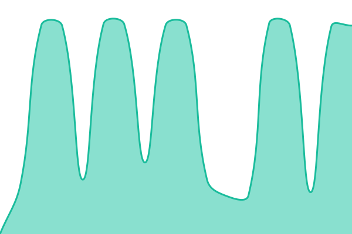

# [📈 Live Status](https://devkraft-shashanksingh.github.io/uptime-monitor): <!--live status--> **🟧 Partial outage**

This repository contains the open-source uptime monitor and status page for [Shashank Singh](https://devkraft-shashanksingh.github.io/uptime-monitor), powered by [Upptime](https://github.com/upptime/upptime).

With [Upptime](https://upptime.js.org), you can get your own unlimited and free uptime monitor and status page, powered entirely by a GitHub repository. We use [Issues](https://github.com/devkraft-shashanksingh/uptime-monitor/issues) as incident reports, [Actions](https://github.com/devkraft-shashanksingh/uptime-monitor/actions) as uptime monitors, and [Pages](https://devkraft-shashanksingh.github.io/uptime-monitor) for the status page.

<!--start: status pages-->
<!-- This summary is generated by Upptime (https://github.com/upptime/upptime) -->
<!-- Do not edit this manually, your changes will be overwritten -->
<!-- prettier-ignore -->
| URL | Status | History | Response Time | Uptime |
| --- | ------ | ------- | ------------- | ------ |
|  [GIST QA API](https://gist-qa.indegene.com/api/v1/health) | 🟩 Up | [gist-qa-api.yml](https://github.com/devkraft-shashanksingh/uptime-monitor/commits/HEAD/history/gist-qa-api.yml) | 

 3860ms
     
 | 

<a href="https://devkraft-shashanksingh.github.io/uptime-monitor/history/gist-qa-api">100.00%</a>
    

|  [Bayer QA](https://bayer-ws-qa.indegene.com/bapi/v1/health) | 🟩 Up | [bayer-qa.yml](https://github.com/devkraft-shashanksingh/uptime-monitor/commits/HEAD/history/bayer-qa.yml) | 

 755ms
     
 | 

<a href="https://devkraft-shashanksingh.github.io/uptime-monitor/history/bayer-qa">100.00%</a>
    

|  [Bayer UAT](https://bayer-ws-uat.indegene.com/bapi/v1/health) | 🟩 Up | [bayer-uat.yml](https://github.com/devkraft-shashanksingh/uptime-monitor/commits/HEAD/history/bayer-uat.yml) | 

 758ms
     
 | 

<a href="https://devkraft-shashanksingh.github.io/uptime-monitor/history/bayer-uat">93.11%</a>
    

|  [Bayer PROD](https://bayer-ws.indegene.com/bapi/v1/health) | 🟩 Up | [bayer-prod.yml](https://github.com/devkraft-shashanksingh/uptime-monitor/commits/HEAD/history/bayer-prod.yml) | 

 190ms
     
 | 

<a href="https://devkraft-shashanksingh.github.io/uptime-monitor/history/bayer-prod">97.42%</a>
    

|  [AOR Debranded QA](https://aor-debranded-demo.indegene.com/bapi/v1/health) | 🟩 Up | [aor-debranded-qa.yml](https://github.com/devkraft-shashanksingh/uptime-monitor/commits/HEAD/history/aor-debranded-qa.yml) | 

 724ms
     
 | 

<a href="https://devkraft-shashanksingh.github.io/uptime-monitor/history/aor-debranded-qa">94.84%</a>
    

|  [AOR WS](https://aor-ws.indegene.com/bapi/v1/health) | 🟩 Up | [aor-ws.yml](https://github.com/devkraft-shashanksingh/uptime-monitor/commits/HEAD/history/aor-ws.yml) | 

 181ms
     
 | 

<a href="https://devkraft-shashanksingh.github.io/uptime-monitor/history/aor-ws">97.45%</a>
    

|  [AOR Agents Comm Demo](https://agents-comm-demo.indegene.com/bapi/v1/health) | 🟩 Up | [aor-agents-comm-demo.yml](https://github.com/devkraft-shashanksingh/uptime-monitor/commits/HEAD/history/aor-agents-comm-demo.yml) | 

 729ms
     
 | 

<a href="https://devkraft-shashanksingh.github.io/uptime-monitor/history/aor-agents-comm-demo">94.87%</a>
    

|  [Supabase Check](https://genai-qa.indegene.com/next-persona-v2/api/kol-agent/vector-store) | 🟥 Down | [supabase-check.yml](https://github.com/devkraft-shashanksingh/uptime-monitor/commits/HEAD/history/supabase-check.yml) | 

 8099ms
     
 | 

<a href="https://devkraft-shashanksingh.github.io/uptime-monitor/history/supabase-check">42.64%</a>
    

<!--end: status pages-->

[**Visit our status website →**](https://devkraft-shashanksingh.github.io/uptime-monitor)

## 📄 License

- Powered by: [Upptime](https://github.com/upptime/upptime)
- Code: [MIT](./LICENSE) © [Anand Chowdhary](https://anandchowdhary.com)
- Data in the `./history` directory: [Open Database License](https://opendatacommons.org/licenses/odbl/1-0/)
